# API Fetching (A Deep Technical Exploration)

> **Theme:** API Fetching  
> **Type:** Technical Article + Learning-Oriented Application  
> **Goal:** Deep theoretical understanding of API fetching systems and how modern frontend applications handle data correctly, efficiently, and predictably

---

## Table of Contents
- Introduction
- What does "API Fetching" Mean?
- API Fetching Fundamentals
  - fetch() API Basics & Syntax
  - XMLHttpRequest (XHR) legacy comparison
  - Promises and async/await Patterns
  - Request Configuration
  - Response Parsing
- Request Libraries & Abstractions
  - Axios vs fetch
  - Library features: interceptors, defaults, transforms
  - Fetch wrappers & custom implementations
  - Type-safe fetching with TypeScript
  - Request & response interceptors (deep dive)
  - Configuration & instance creation
- Loading & Error States
  - Managing loading state
  - Error state handling patterns
  - Race conditions
  - Request cancellation with AbortController
  - Cleanup logic (component unmount)
  - Stale data handling
- Caching & Request Optimization
  - React Query / TanStack Query
  - SWR (Stale-While-Revalidate)
  - Cache strategies & invalidation
  - Request deduplication
  - Prefetching & background refetching
  - Query keys & cache management
- Advanced Fetching Patterns
  - Retry logic & exponential backoff
  - Parallel vs sequential requests
  - Dependent queries
  - Polling & refetch intervals
  - Optimistic updates
  - Mutation handling & side effects
- Implementation Details
- Setup Instructions
---

## Introduction

API Fetching is often treated as a simple operation:
send a request, receive data, update the UI.

In real-world frontend applications, API fetching is a **distributed system problem**.  
It must maintain a smooth user experience while handling latency, failures, caching, synchronization, and performance optimization.

This project explores API Fetching **as a system**, not a function.

---

## What does "API Fetching" Mean?

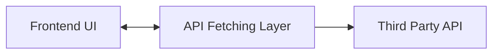

---

### Explanation of some hard terms (if you need :D)

#### Fetching
The process of requesting data from an external API and receiving a response that the application can use.

#### Stale
Cached data that may be outdated but is still displayed to the user temporarily to keep the UI responsive.

#### Revalidate
Refetching data in the background to replace stale cached data with fresh data from the API.

#### Mutate
Manually updating or re-triggering cached data without waiting for a new fetch request, usually to reflect instant UI changes.

API Fetching is not just about sending HTTP requests and receiving responses.
It is a **core architectural layer** in modern frontend applications responsible for:
- Data synchronization
- Performance optimization
- State consistency
- Error handling
- Caching and invalidation

This document is a **technical article**, not simple documentation.

---

## 🔴 API Fetching Fundamentals

### fetch() API Basics & Syntax

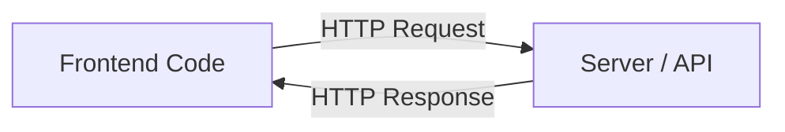

The fetch() API is a modern, promise-based way to make HTTP requests in JavaScript. It is built into browsers and replaces older callback-based solutions.

```js
// Basic fetch: Get data from URL and log it
fetch(url, options)
  .then(response => response.json())  // Convert response to JSON
  .then(data => console.log(data));   // Log the data
```

---

### XMLHttpRequest (XHR) legacy comparison

XMLHttpRequest is the old way of doing API requests, and it existed because:
- Browsers needed a way to load data without reloading the page
- XHR solved this before Promises existed

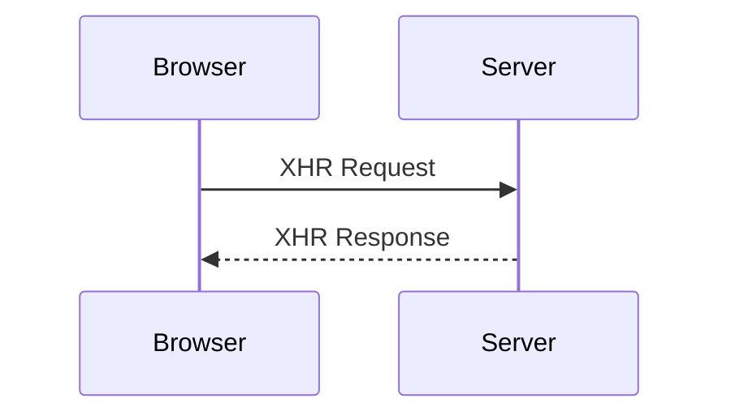
```javascript
// Sample usage of fetching with the GET method XMLHttpRequest

// Create a new XHR object
const xhr = new XMLHttpRequest();

// Configure it: GET request to a URL
xhr.open('GET', 'https://api.example.com/users');

// Set up what happens when the response comes back
xhr.onload = function() {
  if (xhr.status === 200) {  // If successful (status code 200)
    const data = JSON.parse(xhr.responseText);  // Parse the JSON response
    console.log(data);  // Do something with the data
  } else {
    console.log('Error:', xhr.status);  // Handle error
  }
};

// Set up what happens if there's a network error
xhr.onerror = function() {
  console.log('Network error occurred');
};

// Send the request
xhr.send();
```
#### Problems with XHR
- **Callback-based** - Uses nested callback functions that create "callback hell" when chaining requests, making code hard to follow
- **Hard to manage** - Requires manually tracking request states, handling timeouts, and managing multiple event listeners (onload, onerror, onprogress)
- **Poor readability** - Verbose syntax with lots of boilerplate code; simple tasks require many lines

#### Why fetch() is better
- **Promise-based** - Returns Promises, allowing the usage of `.then()` or `async/await` for cleaner sequential code
- **Cleaner syntax** - Minimal code needed; one-liners for simple requests instead of 10+ lines
- **Better error handling** - Centralized `.catch()` blocks instead of multiple error callbacks; easier to debug
- **Modern standard** - Built into all modern browsers and Node.js; widely supported and actively maintained

> XHR is like driving a manual car : powerful, but painful  
> fetch is automatic transmission

---

### Promises and async/await Patterns

A Promise represents a not-yet-ready value that will be available later and may succeed or fail.  
It has three states:
- pending
- fulfilled
- rejected

#### Promise Chain (.then)
```js
// Fetch with Promise error handling
fetch(url)
  .then(res => res.json())            // Convert to JSON
  .then(data => handleData(data))     // Do something with the data
  .catch(err => handleError(err))     // Handle any errors that occur
```

#### Why Promises exist:
- API calls take time
- JavaScript shouldn't block the UI

`async/await` is syntax sugar over Promises.

#### Async/Await (Modern)
```js
// Async/await version - cleaner syntax for the same thing
async function getData() {
  const response = await fetch(url);  // Wait for the request to complete
  const data = await response.json(); // Wait for JSON conversion
  return data;                        // Return the data
}
}
```

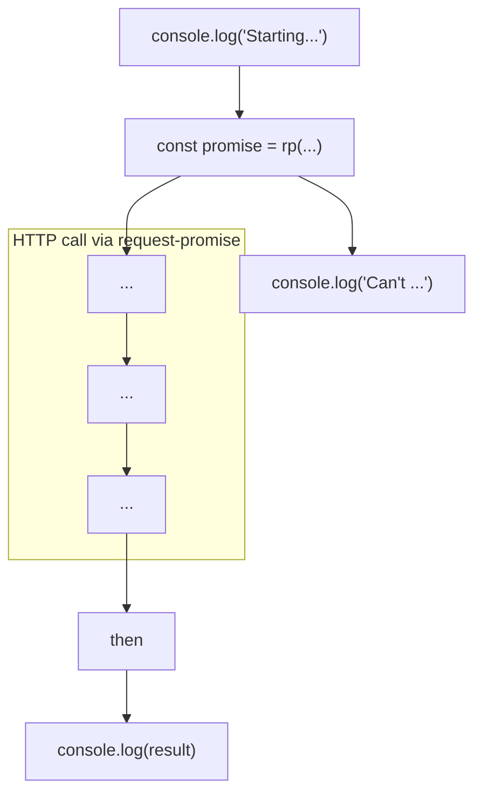

#### Benefits of Async/Await
- More readable, synchronous-looking code
- Easier debugging and error handling
- Avoids “callback hell”
- Better for complex async operations

---

### Request Configuration

Request configuration defines how the request is sent.
A request is not just a URL. It contains:
- method: the action the user wants (GET, POST, PUT, DELETE)
- headers: metadata (content type, auth tokens, language)
- body: the actual data you send (usually JSON)

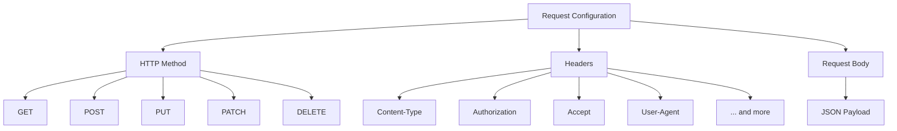

```js
// POST request: Sending data to the server
fetch(url, {
  method: "POST",
  headers: {
    "Content-Type": "application/json",      // Tell server data format
    "Authorization": "Bearer token",         // Authentication token
    "Accept": "application/json",            // What response format we want
    "User-Agent": "MyApp/1.0",              // Identify our application
    // ... many more headers can be added
  },
  body: JSON.stringify({ name: "John" })    // Convert object to JSON string
});
```

#### Why configuration matters:
- Server's behavior is based on method
- Requests without correct headers might be rejected by the API :((
- Security and authentication rely on headers

> The URL is where  
> Method is what you want  
> Headers are how you talk  
> Body is what you send

---

### Response Parsing

API responses must be transformed into usable formats.

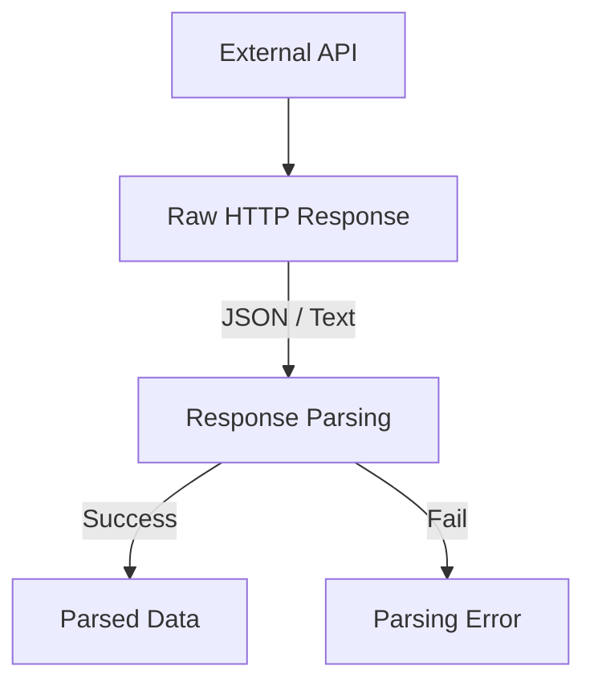

`.json()`  
parse JSON response data (most common for APIs)
```js
const data = await response.json(); 
```

`.text()`  
parse plain text response (HTML, CSV, etc...)
```js
const text = await response.text();  
```

`.blob()`  
parse binary data (images, files, videos)
```js
const blob = await response.blob();
const imageUrl = URL.createObjectURL(blob);
```

---

## 🟤 What are Request Libraries & Abstractions?

> How do we make fetching cleaner, safer, and reusable?

Raw `fetch()` gives you low-level control, but real-world applications need **consistency, reuse, safety, and extensibility**.  
Request libraries sit **on top of fetch/XHR** and provide a structured layer to manage configuration, errors, transformations, and cross-cutting concerns.

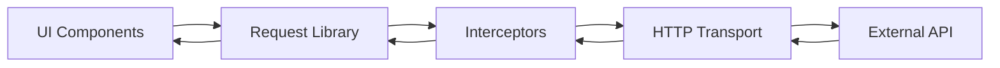

---

### Axios vs fetch, Conceptual Comparison

fetch → native, low-level, minimal abstraction, requires manual handling

axios → external library, parses JSON automatically, better error handling, supports interceptors

> fetch is raw ingredients  
> axios is a prepared kitchen

#### Professional Comparison Matrix

| Aspect | fetch (Native API) | axios (Request Library) |
|------|-------------------|-------------------------|
| Level of abstraction | Low-level browser API | High-level abstraction |
| Built-in availability | Built into browsers | External dependency |
| JSON parsing | Manual (`response.json()`) | Automatic |
| Error handling | No automatic HTTP error rejection | Automatically rejects non-2xx |
| Interceptors | Not supported | Fully supported |
| Request cancellation | `AbortController` (manual) | Built-in cancellation |
| Global defaults | Not available | Supported |
| Instance creation | Not supported | Supported |
| Request/response transforms | Not supported | Supported |
| TypeScript experience | Basic | Excellent |
| Enterprise readiness | Limited | High |

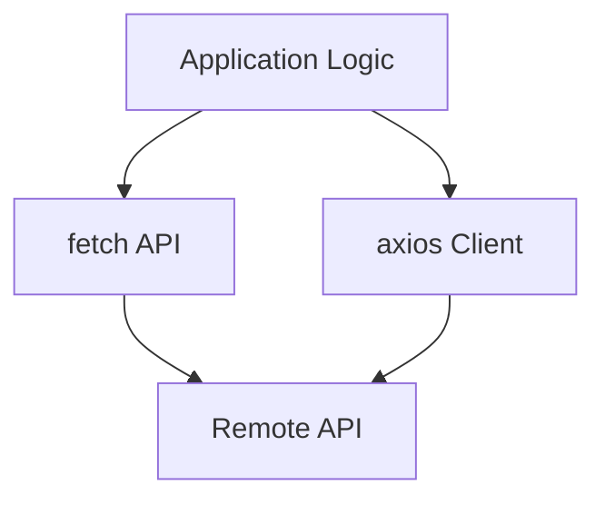

---

### Library Features : Interceptors, Defaults, Transforms

#### Defaults : 
- Set base URL
- Common headers
- Timeouts

#### Interceptors :
- Run logic before request
- Run logic after response
- **Use cases:**
  - Attach auth tokens
  - Log errors
  - Refresh expired tokens

#### Transforms : 
- Modify request data
- Normalize response data

#### Interceptor Flow
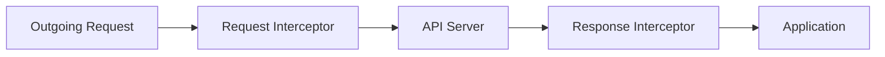

---

### Request & Response Interceptors

**Interceptors** are code blocks that let you modify requests before they're sent or responses before they're used. Think of them as middleware that sits between your code and the actual network call.

#### Common use cases:
- Adding authentication tokens to all requests
- Logging all API calls
- Transforming response data consistently
- Handling errors globally (like 401 unauthorized)
- Adding custom headers
- Retry logic

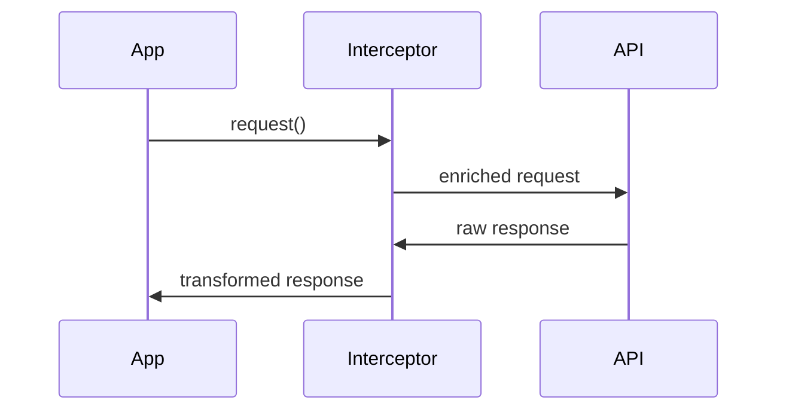

---

### Fetch Interceptors

Native `fetch()` **does not support interceptors**. Unlike libraries like Axios, you cannot automatically modify requests before they're sent or handle responses globally.

**What you can't do natively:**
- Automatically add auth tokens to every request
- Log all API calls in one place
- Handle 401 errors globally (like redirecting to login)
- Retry failed requests automatically

**Some workarounds exist, such as :**

#### 1. **Wrapper Functions** (Simple approach)
Create a custom function that wraps fetch:

```javascript
async function apiFetch(url, options = {}) {
  // Add token to every request
  const response = await fetch(url, {
    ...options,
    headers: {
      ...options.headers,
      'Authorization': `Bearer ${token}`
    }
  });
  
  // Handle errors globally
  if (response.status === 401) {
    redirectToLogin();
  }
  
  return response;
}

// Use it instead of fetch
apiFetch('/api/users');
```

#### 2. **Monkey-Patching** (Override native fetch)
Replace the native fetch with your own version:

```javascript
const originalFetch = window.fetch;

window.fetch = function(...args) {
  console.log('Request:', args[0]);  // Log every request
  
  // Modify request before sending
  return originalFetch(...args).then(response => {
    console.log('Response:', response.status);
    return response;
  });
};
```

⚠️ **Warning:** Monkey-patching can cause issues with other libraries and is harder to maintain.

#### 3. **External Libraries** (Recommended)
Use libraries like **fetch-intercept** that add interceptor functionality:

```javascript
import fetchIntercept from 'fetch-intercept';

// Register interceptors
fetchIntercept.register({
  request: function(url, config) {
    // Modify every request
    config.headers['Authorization'] = `Bearer ${token}`;
    return [url, config];
  },
  
  response: function(response) {
    // Handle every response
    if (response.status === 401) {
      redirectToLogin();
    }
    return response;
  }
});

// Now all fetch calls are intercepted automatically
fetch('/api/users');  // Token added automatically!
```

--- 

### Axios Interceptors

The native `fetch` doesn't support interceptors, which is why these workarounds exist. **Axios** has built-in interceptor support:

```js
// Example of an interceptor adding auth token to every Axios request automatically
axios.interceptors.request.use(config => {
    config.headers.Authorization = `Bearer ${token}`; // Inject token
    return config;
});

// Handle unauthorized errors globally (like expired login)
axios.interceptors.response.use(
    response => response,  // If successful, just return the response
    error => {
        if (error.response.status === 401) { // If unauthorized (token expired)
            redirectToLogin();  // Send user back to login page
        }
        return Promise.reject(error); // Pass error to the catch block
    }
);
```

---

### Defaults : Configuration & Instance Creation

Instead of configuring every request, with Axios it is possible to create a single configured instance and reuse it everywhere with consistency, maintainability and easy debugging.

#### Axios Instance Example
```js
// Axios instance (Defaults): Pre-configured setup for all requests
const api = axios.create({
  baseURL: "/api",      // All requests will start with "/api"
  timeout: 5000,        // Fail if request takes longer than 5 seconds
  headers: {
    "Content-Type": "application/json" // Default header for all requests
  }
});

api.get("/users"); // This actually calls "/api/users" with the above configuration
```

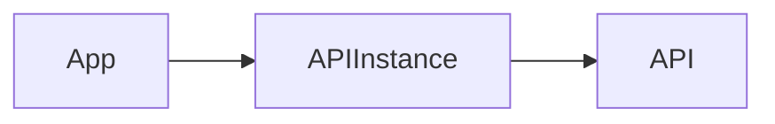


### Fetch Wrappers & Custom Implementations

Wrappers exist because raw fetch leads to repeated headers and error checks, in addition to inconsistent parsing.  
A wrapper is your own function around fetch or axios.

#### Wrapper Example
```js
// Custom fetch wrapper: Reusable function with defaults
async function apiFetch(url, options = {}) {
  const response = await fetch(url, {
    headers: { "Content-Type": "application/json" }, // Default header
    ...options  // Allow overriding with custom options
  });

  if (!response.ok) {  // Check if request failed (status 400-599)
    throw new Error("Request failed");
  }

  return response.json(); // Return parsed JSON
}
```

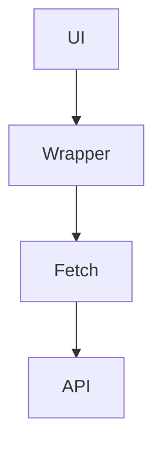

---

### Type-Safe Fetching with TypeScript

Type safety ensures:
- API contracts are respected
- Fewer runtime failures
- Stronger IDE support

Types are contracts between frontend and backend; they catch many errors early and improve reliability.

Typed Fetch Example

```ts
// TypeScript version: Specify the return type

type User = {
  id: number;
  name: string;
};

async function getUser(): Promise<User> {
  const response = await fetch("/user");
  return response.json(); // TypeScript knows this returns a User object
}
```

#### Impact Analysis

| Without Type Safety       | With Type Safety          |
|---------------------------|---------------------------|
| Runtime crashes           | Compile-time validation   |
| Weak autocomplete         | Strong IntelliSense       |
| Implicit contract         | Explicit API schema       |
| Debug-heavy               | Predictable behavior      |

---

### Summary

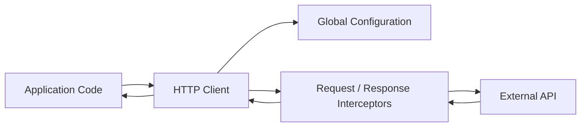

---

## 🟡 Loading & Error States (Frontend Data)

### Overview

Loading and error states aren't just UI details but **core system behavior**.  
Every API request exists in time, and the frontend must **represent that timeline visually and logically**.

### Managing Loading State

A **loading state** represents the period between sending a request and receiving a response.

Without a loading state users would think the app is broken and click multiple times, causing duplicate requests.

> **If data is not ready, the UI must say so explicitly.**

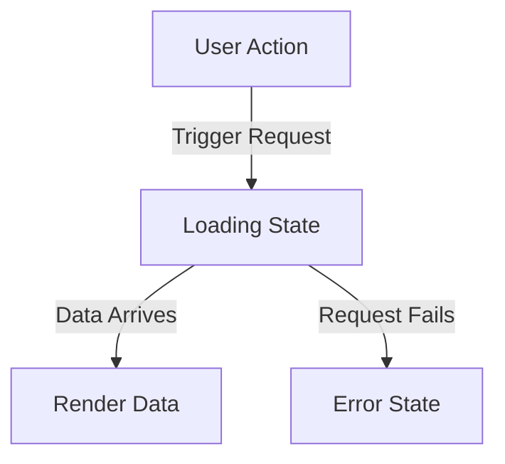

#### Typical UI Patterns : 
- Skeleton loaders
- Spinners
- Shimmer effects
- Disabled buttons

| State | When It Happens | UI Behavior | Goal |
|------|----------------|-------------|------|
| Idle | Before request starts | Show placeholder or empty UI | Avoid confusion |
| Loading | Request in progress | Spinner / skeleton | Show progress |
| Success | Data received | Render data | Display content |
| Error | Request failed | Error message | Inform user |
| Cancelled | Request aborted | Reset or keep previous UI | Prevent stale updates |

---

### Error State Handling Patterns

An error state represents any failure during:
- network communication
- server response
- data parsing
- request timeout

Errors are expected, not exceptions.

Categories of Errors

| Error Type | Cause | Recommended Handling | 
|-----------|------|----------------------|
| Network Error | No internet / timeout | Retry or show offline state | 
| Server Error (5xx) | Backend failure | Show retry option | 
| Client Error (4xx) | Bad request / unauthorized | Show message | 
| Cancelled Request | User action | Silent handling | 
| Unknown Error | Unexpected failure | Fallback error UI | 

---

### Basic Error Handling with try/catch

Network failure, server crash, invalid response and wrong parsing are all possible errors, so `try/catch` creates a controlled failure zone.

Try/Catch Pattern

```js
try {
  const response = await fetch(url);
  if (!response.ok) throw new Error("Failed");
  const data = await response.json();
} catch (error) {
  console.error("Error:", error);
}
```

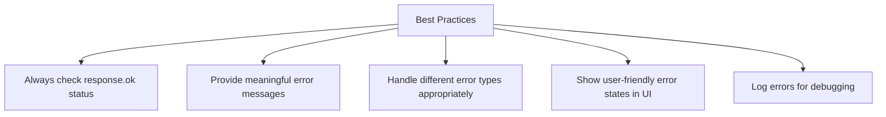

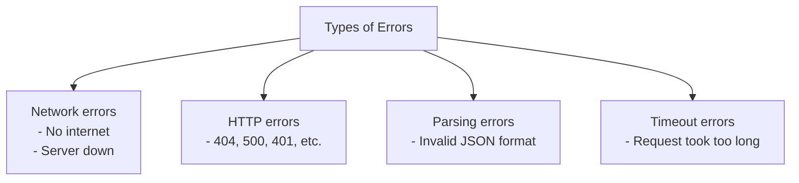

#### Error handling ensures:
- App doesn't crash
- UI remains stable
- Errors are displayed gracefully

> “If anything breaks inside this box, catch it and react”

---

### Success / Failure UI Feedback

Feedback matters because users need confirmation:

Success → reassurance

Failure → explanation + recovery path

---

### Race Conditions

A race condition happens when multiple requests are triggered, responses arrive out of order, and old data overrides new data.

Example Scenario
1. User types fast
2. Request A sent
3. Request B sent
4. Response A arrives after B
5. UI shows outdated results

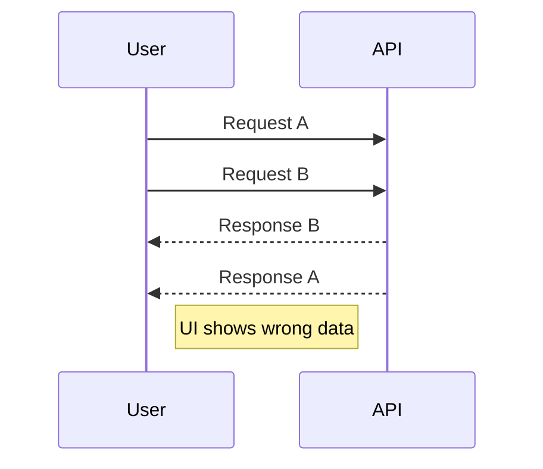

| Scenario | Problem | Solution |
|--------|---------|----------|
| Fast repeated requests | Old response overrides new | Abort previous request |
| Multiple tab fetches | Inconsistent data | Shared cache |
| Slow network | UI shows wrong data | Request cancellation |

#### Example for Race Condition (No Protection)
```js
async function searchUsers(query) {
  const response = await fetch(`/api/search?q=${query}`);
  const data = await response.json();
  setResults(data);
}
```

---

### Request Cancellation with AbortController

Cancellation is needed because it prevents outdated responses, avoids memory leaks and improves performance.

AbortController allows the frontend to cancel an in-flight request.

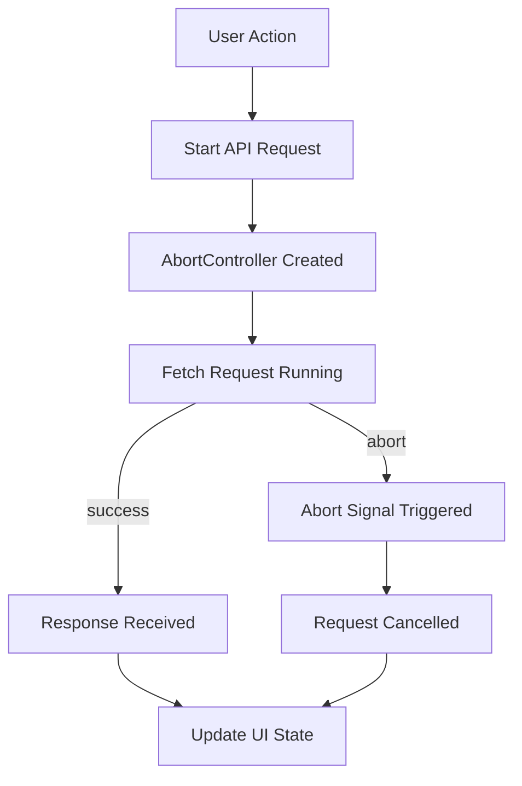

#### Example Fixed with AbortController
```js
let controller;

async function searchUsers(query) {
  // Cancel previous request
  if (controller) {
    controller.abort();
  }

  controller = new AbortController();

  try {
    const response = await fetch(`/api/search?q=${query}`, {
      signal: controller.signal
    });

    const data = await response.json();
    setResults(data);
  } catch (error) {
    if (error.name !== "AbortError") {
      console.error("Request failed", error);
    }
  }
}
```

---

### Cleanup Logic (Component Unmount)

#### Problem:
Requests can still resolve after a component is destroyed.

#### Solution:
Always clean up: timers, subscriptions and requests.

#### Pattern
```js
useEffect(() => {
  const controller = new AbortController();

  fetch(url, { signal: controller.signal });

  return () => controller.abort();
}, []);
```

---

### Stale Data Handling

Stale data = cached data that may be outdated but is still shown temporarily to improve performance.

#### Why it exists:
- Instant UI
- Reduced loading
- Better UX

#### Strategy
> Show stale → fetch fresh → update silently

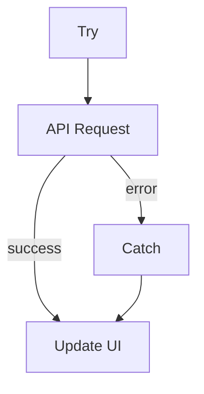

| Situation | Risk | Strategy |
|----------|------|----------|
| Cached data too old | Incorrect UI | Background refetch |
| User revisits page | Outdated info | Revalidate on focus |
| Offline usage | Stale content | Cache with fallback |

#### Example : Stale Data Not Handled
```js
async function getProfile() {
  const res = await fetch("/api/profile");
  return res.json();
}
```

#### Problem:
- Data is fetched once
- Never refreshed
- UI may show outdated information

#### Example : Manual Stale Handling (Timestamp)
```js
let lastFetchedAt = 0;
const STALE_TIME = 10000; // 10 seconds
let cachedProfile = null;

async function getProfile() {
  const now = Date.now();

  if (now - lastFetchedAt < STALE_TIME && cachedProfile) {
    return cachedProfile;
  }

  const res = await fetch("/api/profile");
  const data = await res.json();

  cachedProfile = data;
  lastFetchedAt = now;

  return data;
}
```

- Data is reused while “fresh”
- Automatically refetched when stale
- Prevents unnecessary network calls

#### BEST PRACTICE : TanStack Query
```js
useQuery({
  queryKey: ["profile"],
  queryFn: fetchProfile,
  staleTime: 10000,      // data stays fresh for 10s
  refetchOnWindowFocus: true
});
```
- Automatic stale detection
- Background refetching
- UI stays responsive
- Zero manual cache logic

---

Summary :
| Problem | Pattern Used |
|-------|-------------|
| User waiting too long | Loading state |
| App crashes on failure | Error boundaries |
| Old data overrides new | AbortController |
| UI feels frozen | Skeleton loading |
| Data becomes outdated | Stale revalidation |

---

## 🔵 Caching & Request Optimization

### React Query / TanStack Query

#### Objective:
Improve performance, reduce unnecessary network calls, and keep frontend data consistent on the frontend.

React Query (TanStack Query) acts as a **smart layer** between the UI and the API, handling data fetching, caching, and synchronization automatically.  
Instead of managing loading and error states manually, it centralizes server-state logic and keeps the UI consistent and performant.

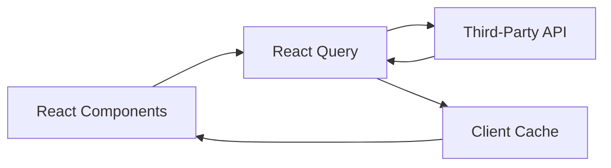

#### Why it matters:
API fetching becomes state management, not just HTTP calls.

---

### SWR (Stale While Revalidate pattern)

```mermaid
flowchart TD
    Request[Request Data]
    Request --> Cache[Cached Data]
    Cache --> UI[Instant UI]
    Cache --> Revalidate[Background Revalidation]
```

SWR follows the stale-while-revalidate strategy by serving cached data instantly while revalidating it in the background.  
This approach provides fast user feedback while ensuring the data stays fresh without blocking the UI.

Key Difference [SWR vs React Query]

SWR → simple & automatic

React Query → advanced control & configuration

---

### Cache Strategies & Invalidation

```mermaid
flowchart LR
    Request[Request] --> Cache[Cache]
    Cache --> Fresh[Fresh data]
    Cache --> Stale[Stale data]
    Stale --> Refetch[Refetch]
```

Caching stores previously fetched data to avoid unnecessary network requests.  
Invalidation ensures that outdated data is refreshed at the right time, maintaining correctness while still benefiting from performance optimizations.

#### Tools:
React Query → staleTime, invalidateQueries  
SWR → mutate

### Request Deduplication

Request deduplication prevents multiple components from triggering the same API request simultaneously

```mermaid
flowchart TD
    A[Component A] --> Key[Same Query Key]
    B[Component B] --> Key
    Key --> Single[Single Network Request]
```

Request deduplication prevents multiple components from triggering the same API call simultaneously.  
Instead, one network request is shared, reducing bandwidth usage and improving application efficiency.

#### Why it matters:
- Prevents API spam
- Saves bandwidth
- Improves performance

---

### Prefetching & Background Refetching

Prefetching loads data before the user actually needs it, making navigation feel instant.  
Background refetching keeps cached data fresh without blocking the UI.

```mermaid
graph LR
    A["Current Page"] --> B["Prefetch data"]
    B --> C["Cache"]
    D["Next Page"] --> C
```

---

### Query Keys & Cache Management

```mermaid
flowchart LR
    Key1["Key 1 user1"] --> CacheStore[Cache Store]
    Key2["Key 2 user2"] --> CacheStore
```

Query keys uniquely identify each piece of cached data and define how it is stored and retrieved.  
Proper cache management using query keys enables precise updates, refetching, and invalidation of specific data.

#### Why it matters
Without query keys, cache invalidation becomes impossible.

```js
useQuery(["users", userId], fetchUser)
```

Query keys uniquely identify cached data so: changing the key = different cache entry.

---

## 🟣 Advanced Fetching Patterns

### Retry Logic & Exponential Backoff

Retry logic automatically retries a failed HTTP request instead of failing immediately, usually for temporary issues like network glitches or server hiccups.  
Exponential backoff slowly increases the wait time between each retry (for example 0.5 s, then 1 s, then 2 s), so you avoid hammering the server while still giving the request multiple chances to succeed.

#### Exponential Backoff Formula
delay = baseDelay × 2^attempt

```mermaid
flowchart TD
  A[Start request] --> B[Call fetchWithRetry]
  B --> C[Send HTTP request]

  C -->|success 2xx| G[Return response]
  C -->|http 429 or 5xx| D[Check if retry allowed]
  C -->|network error| D
  C -->|other error| H[Fail without retry]

  D -->|not retryable| H
  D -->|retryable| E[Retries remaining?]

  E -->|no| H
  E -->|yes| F[Compute backoff delay]

  F --> I[Wait delay]
  I --> C

  G --> J[Show data to user]
  H --> K[Show friendly error]
```

#### Example:
```js
async function fetchWithRetry(fn, retries = 3, delay = 500) {
  try {
    return await fn()
  } catch (err) {
    if (retries === 0) throw err
    await new Promise(r => setTimeout(r, delay))
    return fetchWithRetry(fn, retries - 1, delay * 2)
  }
}
```

---

### Parallel vs Sequential Requests

Sequential requests wait for one HTTP call to finish before starting the next, which is simpler but slower. Parallel requests start several calls at the same time.  
Promise.all runs promises in parallel and only succeeds if every one succeeds, while Promise.allSettled also runs them in parallel but always gives you a result array showing which calls passed or failed.

```mermaid
flowchart TD
  A[Start] --> B{Run multiple requests}

  B --> C[Sequential]
  B --> D[Parallel]

  %% Sequential path
  C --> C1[Request 1]
  C1 --> C2[Request 2]
  C2 --> C3[Request 3]
  C3 --> C4[Total time ≈ sum of all]

  %% Parallel with Promise.all
  D --> D1[Create promises]
  D1 --> D2[Use Promise.all]
  D2 --> D3[All must succeed or whole thing fails]

  %% Parallel with Promise.allSettled
  D1 --> E1[Use Promise.allSettled]
  E1 --> E2[Get array of\nfulfilled and rejected]

  C4 --> F[Good when calls depend\non each other]
  D3 --> G[Good when you need\nall results]
  E2 --> H[Good when partial\nresults are OK]
```

```js
// Parallel
const [users, posts] = await Promise.all([
  fetchUsers(),
  fetchPosts()
]);

// Sequential
const user = await fetchUser();
const posts = await fetchPosts(user.id);
```

| Approach | Execution | Use Case | Performance |
|--------|-----------|----------|-------------|
| Sequential | One after another | Dependent requests | Slower |
| Parallel | Simultaneous | Independent requests | Faster |
| Promise.all | Fail fast | All must succeed | High |
| Promise.allSettled | Collect all results | Partial success allowed | Medium |

---

### Dependent Queries

Dependent queries model real-world data relationships where one request is logically impossible without the result of another. Instead of firing all requests blindly, the system enforces sequencing at runtime.

```mermaid
flowchart TD
    U[User Opens Page]

    U --> Q1[Query: Fetch User]
    Q1 -->|Loading| L1[Show Skeleton]
    Q1 -->|Error| E1[User Error State]

    Q1 -->|Success| D1[User Data Available]

    D1 --> Q2[Query: Fetch User Projects]
    Q2 -->|Loading| L2[Partial UI State]
    Q2 -->|Error| E2[Projects Error]

    Q2 -->|Success| D2[Projects Data]

    D2 --> Q3[Query: Fetch Project Stats]
    Q3 -->|Success| UI[Render Full UI]
```

#### Code Example
```js
const userQuery = useQuery({
  queryKey: ["user"],
  queryFn: fetchUser
});

const projectsQuery = useQuery({
  queryKey: ["projects", userQuery.data?.id],
  queryFn: () => fetchProjects(userQuery.data.id),
  enabled: !!userQuery.data
});
```

---

### Polling & Refetch Intervals

Polling treats data as a moving target rather than a static snapshot. Instead of waiting for user actions, the client periodically revalidates its cache against the server. This is crucial for live systems.

```mermaid
flowchart LR
    S[Start Query]

    S --> F1[Initial Fetch]
    F1 --> C1[Cache Data]

    C1 --> T[Timer Interval]
    T --> F2[Refetch]

    F2 --> D{Data Changed?}
    D -->|Yes| U[Update Cache]
    D -->|No| K[Keep Cache]

    U --> T
    K --> T
```

### Code Example:
```js
useQuery({
  queryKey: ["systemStatus"],
  queryFn: fetchSystemStatus,
  refetchInterval: 3000,
  staleTime: 0
});
```

---

### Optimistic Updates

Optimistic updates prioritize user experience by assuming success before the server responds. The UI updates immediately, while the real request happens in the background. To stay safe, the previous state should be stored to allow rollback on failure.

```mermaid
flowchart TD
    Action[User Action]
    Optimistic[Update UI Immediately]
    Server[Send Request]
    Success[Server Confirms]
    Error[Server Rejects]
    Rollback[Revert UI]

    Action --> Optimistic
    Optimistic --> Server
    Server -->|success| Success
    Server -->|error| Error
    Error --> Rollback
```

---

### Mutation Handling & Side Effects

Mutation handling is about managing actions that change data (create, update, delete) and controlling what happens around them. These actions usually cause side effects like updating the UI, refreshing cache, or invalidating queries.

```mermaid
flowchart TD
    Trigger[Trigger Mutation]
    Pending[Loading State]
    Success[Success]
    Error[Error]
    Invalidate[Invalidate Cache]
    Refetch[Refetch Data]

    Trigger --> Pending
    Pending -->|success| Success
    Pending -->|error| Error
    Success --> Invalidate
    Invalidate --> Refetch
```

Best Practice:
- Never mutate cached data manually
- Always let the query system refetch or reconcile

| Action | Purpose |
|------|---------|
| Mutation | Change server state |
| Loading State | Disable inputs |
| Success Handling | Show feedback |
| Cache Invalidation | Prevent stale data |
| Refetch | Sync UI with server |

> Advanced fetching is not about “getting data”.
It’s about controlling time, failure, consistency, and user perception.


---


## Implementation Details


This project is implemented as a **frontend-only, interactive learning system** designed to explore and compare API fetching strategies in modern web applications. Rather than acting as a production data client, the application focuses on **observability, clarity, and controlled experimentation**.

The implementation prioritizes **conceptual correctness**, **visual traceability**, and **developer understanding** over backend complexity.

---

### Architectural Approach

The application is built as a **modular React interface** where each fetching concept is isolated into its own interactive view. Each view follows the same internal structure:

- A **theoretical explanation** of the concept
- A **real code implementation**
- A **controlled execution trigger**
- A **visualized request lifecycle**
- A **deterministic output panel**


> The absence of a backend is intentional. All requests are executed directly in the browser using public APIs to preserve transparency and eliminate abstraction layers that could obscure learning.

---

### Unified Execution Model

All fetching approaches (Fetch, XMLHttpRequest, Promises, async/await, configured requests, parsing, error handling, and React’s `use()` hook) follow a shared execution model:

1. User initiates a request
2. Request enters a defined lifecycle state
3. Data or error is resolved
4. UI updates deterministically
5. Logs reflect the exact execution path

This consistency makes differences between approaches **explicit rather than implicit**.


### Interactive Comparison Design

Instead of static examples, the implementation uses **side-by-side execution** where applicable:

- Same endpoint
- Same request parameters
- Same UI constraints
- Different fetching mechanisms

This design eliminates misleading comparisons and ensures that observed differences come **only from the fetching strategy itself**.

---

### State & Lifecycle Control

 State is managed within each module to:

- Keep request lifecycles visible
- Prevent hidden caching or deduplication
- Make race conditions and stale data observable
- Maintain predictable UI transitions

This aligns with the educational goal of exposing internal behavior rather than optimizing it away.

---

### Error Handling Strategy

Error handling is implemented explicitly rather than implicitly:

- HTTP errors are handled via `response.ok`
- Network failures are caught via `try/catch`
- Parsing failures are treated as first-class errors
- UI feedback is separated from console diagnostics

This mirrors real-world frontend constraints while keeping failure modes understandable.

---

### React `use()` Hook Integration

The `use()` hook example is implemented as an **experimental conceptual bridge**, not a replacement for data-fetching libraries.

Its implementation demonstrates:
- Promise suspension behavior
- Error boundary integration
- The difference between **reading async data** and **managing request state**

The project intentionally avoids combining `use()` with caching layers to keep its role clearly defined.

---

### Visual Traceability

Each module includes:
- Step-based animated diagrams
- Explicit lifecycle states
- Console output synchronized with UI state
- Resettable execution paths

This allows users to mentally map **code → request → response → UI** without guesswork.

---


### Summary

This implementation treats API fetching as a **system of behaviors**, not a single function call. By combining real network execution with controlled visualization, the project exposes the true complexity of frontend data fetching while remaining approachable and inspectable.

The result is not a demo, but a **learning instrument**, one that prioritizes understanding over abstraction.

---

## Setup Instructions

Follow these steps to get the project running locally:

### 1. Clone the repository
Open your terminal and run the following command to clone the project:
```bash
git clone [https://github.com/moncefy/BUILD-IT-API-FETCHING.git](https://github.com/moncefy/BUILD-IT-API-FETCHING.git)
```
### 2. Navigate to the project folder
```bash
cd BUILD-IT-API-FETCHING
```
### 3. Install dependencies
```bash
npm install // When you run npm install , it looks at your package.json file and downloads every library listed there.
```
### 4. Start the development server
```bash
npm run dev 
```
### Or you can simply try the hosted version 
```bash
visit: https://build-it-api-fetching.netlify.app/
```
---


